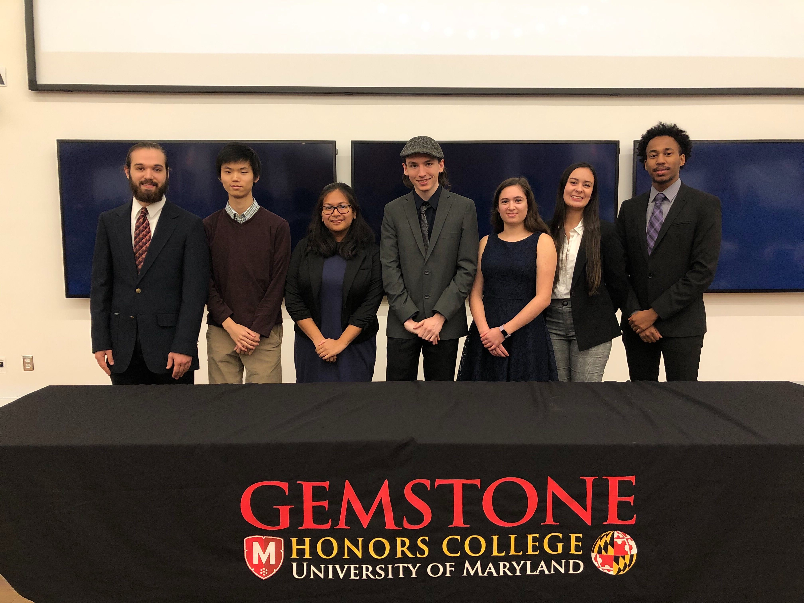

## About AIMAR

We are Gemstone Team AIMAR at the University of Maryland in the class of 2021. AIMAR stands for Artifically Intelligent Medical Assistant Robot, and it will be designed to assist doctors in diagnosing patients of a variety of ailments. The robot will use an array of sensors to collect data from the patient, then feed it to machine learning algorithms that have been trained with sample data to classify the symptoms and make the diagnosis.

## Meet the Team

Team Members: Johan Vandegriff, Kian Ghorbanpoor, Joseph Tseytlin, Nathan Kattapuram, Oliver Pavletic, Natalie Offenberg, Paulos Daniel, Dana Ronin, Kevin Kuo, Michelle Marsandi, Benjamin Jacobsohn, Nina Horne, Ryan Utz

Mentor: Dr. Anil Deane

Librarian: Nedelina Tchangalova

## Goals
- Look into Team SCOPE's previous research
- Find and evaluate existing machine learning medical datasets
- Decide which conditions to diagnose
- Research different machine learning techniques/algorithms
- Implement a natural language speech interface
- Research privacy concerns/laws when dealing with medical data
- Offload data processing from the robot to a server
- Package existing solutions together
- Talk to Synapto, a startup at UMD that diagnoses Alzheimer's with EEG data
- Decide which diagnosis sensors to use
- Decide which navigation sensors to use
- Look into product design and pricing once the prototype is done

## Contact Us
<a id="email" href="#email" onclick="this.innerHTML='&#x202e;'+'moc'+'&#x2e;'+'liamg'+'&#x40;'+'ramiadmu'+'&#x202d;'">click to show email</a>

